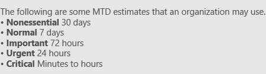
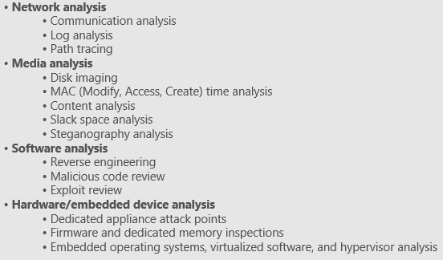
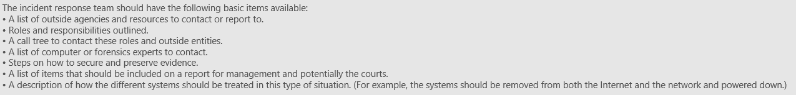
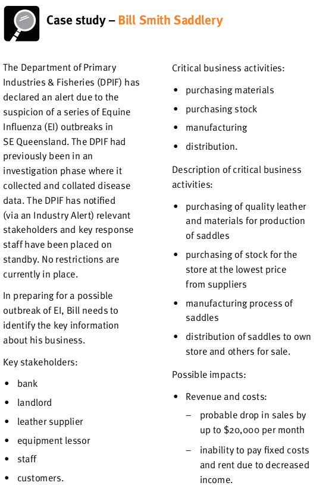
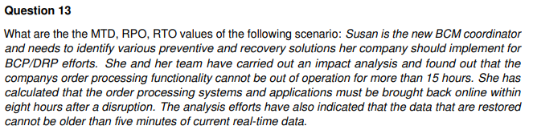
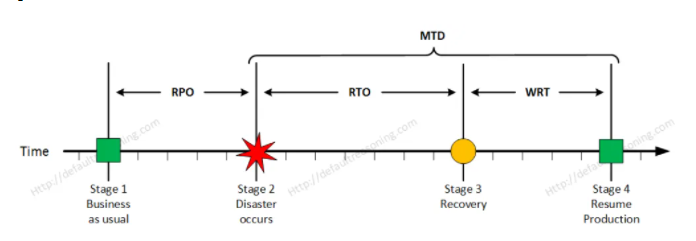

**FROM SLIDE 20**

## BCP vs DRP

-   Business continuity planning is a process designed to reduce the organization’s business risk arising from an unexpected disruption of the critical functions/operations necessary for the survival of the organisation
-   DRP is part of BCP: details the process IT personnel will follow to restore the computer systems and the operational facilities after a disaster

## Disasters

-   Disruptions that cause critical information resources to be inaccessible/inoperative for a period of time, adversely impacting business operations
-   3 classifications:
    -   Natural
        -   E.g., earthquakes, floods
    -   Environmental
        -   E.g., electrical power, telecommunications, equipment failure & software error
    -   Human
        -   E.g., hacker attacks, terrorist attacks, operator error

## BCP Process

-   BCP can be divided into phases:
    -   Conduct BIA (business impact analysis)
    -   Develop COOP (continuity of operations plan) and DRP (disaster recovery plan)
    -   Test the plan + conduct training & exercises
    -   Maintain the plan
-   More detailed:
    -   Develop the continuity planning policy statement
        -   Write a policy that offers the advice required to establish a BCP and delegate authority to the roles required to carry out these activities
    -   Conduct BIA
        -   Identify critical functions and systems and provide the organisation the authority to prioritise them based on necessity. Determine vulnerabilities and threats, as well as hazards
    -   Identify preventive controls
        -   Identify and implement counter measures once threats are identified to reduce the organisation’s risk level
    -   Develop recovery strategies
        -   Develop procedures to ensure that systems and important functions can be brought online as soon as possible
    -   Develop the contingency plan
        -   
    -   Test the plan + conduct training & exercises
    -   Maintain the plan
-   Initiation process might include:
    -   Setting up budget and staff
    -   Assigning duties and responsibilities
    -   Start BCP with a formal announcement or an organisation-wide meeting
    -   Awareness-raising activities
    -   Establishment of skills training
    -   Start of data collection

## Business Impact Analysis

-   Identify critical activities
-   Identify resources to support each activity
-   Evaluate the impact if these activities are not performed + identify priorities
-   Determine recovery criticality (RPO, RTO, MTD)
    -   RPO: recovery point objective
    -   RTO: recovery time objective
    -   MTD: maximum tolerable downtime

## Recovery parameters

-   RPO
    -   The RPO is the earlist point in time (prior to system outage) when mission/business process data can be restored
    -   NOT part of MTD, rather a factor of how much data loss can be tolerated during recovery process
-   RTO
    -   Maximum amount of time a system resource can remain unavailable before there is an unacceptable impact on other system resources
    -   The lower the RTO, the lower the disaster tolerance
-   MTD = RTO + WRT
    -   The total amount of time the system owner/authorising official is willing to accept for a process outage/disruption and includes all impact consideration

-   RPO and RTO are based on time params; the lower the time the higher the cost of recovery strategies
    -   If RPO is minutes (lowest possible data loss) then data mirroring should be implemented
    -   If RTO is less, then alternate site is preferred over hot site contract
-   Work Recovery Time (WRT) determines the maximum tolerable amount of time required to recover lost data and verify data integrity. Time between recovery and normal processing

## Offsite facilities

-   **Choosing location:**
    -   Far enough from main site so that one disaster cannot take out both at the same time
    -   Rule of thumb: at least 5 miles away from primary site bare minimum, 15 miles for low-medium environments, 50-200 for critical operations (protection from regional disasters)
-   Hot site
    -   Leased/rented facility that is fully configured and ready to operate within a few hours
    -   Usually only missing data and the people processing them
    -   Good choice for a company that needs to ensure a site will be available ASAP
    -   Most expensive out of the 3 temperature sites
-   Warm site
    -   Partially configured with some equipment like HVAC
        -   “Hot site” without expensive equipment
    -   Most widely used model
-   Cold site
    -   Facility that supplies the basic environment, electrical wiring, HVAC, plumbing and flooring
    -   Basically an empty data center
    -   Often used as backups for call centres
    -   Cheapest option
-   Reciprocal agreements
    -   Company A agrees to allow company B to use their facilities, vice-versa, in case of, for example, a disaster
    -   Only a short-term solution because a lot of disadvantages
-   Redundant/mirrored sites
    -   Another site configured and equipped exactly the same as the main site, serves as a redundant environment
    -   Business processing capabilities can be completely synchronised
    -   Adv: full availability, under company’s control
    -   Disadv: most expensive
        -   Relative: if the company loses millions if the services is out for a few hours then expense is not an issue

## Offsite facilities – advantage vs disadvantage

-   Hot site
    -   Advantage
        -   High availability
        -   Ready within hours of operation
        -   Used as short term solution
    -   Disadvantage
        -   Very expensive & limited on hardware & software choices
-   Warm & cold site
    -   Advantage
        -   Cheaper
        -   Longer-term solution
        -   Flexible hardware choices
    -   Disadvantage
        -   Takes longer to setup

## Contingency plan

-   Supporting information & appendices
    -   BIA
    -   Emergency contacts
    -   Recovery procedures
    -   The supporting information component includes an introduction and concept of operations section providing essential background or contextual information that makes the contingency plan easier to understand, implement, and maintain. These details aid in understanding the applicability of the guidance, in making decisions on how to use the plan, and in providing information on where associated plans and information outside the scope of the plan may be found.
    -   This section may contain the roles and responsibilities section presents the overall structure of contingency teams, including the hierarchy and coordination mechanisms and requirements among the teams. The section also provides an overview of team member roles and responsibilities in a contingency situation. Teams and team members should be designated for specific response and recovery roles during contingency plan activation.
-   Main phases
    -   Activation & notification
        -   The Activation and Notification Phase defines initial actions taken once a system disruption or outage has been detected or appears to be imminent. This phase includes activities to notify recovery personnel, conduct an outage assessment, and activate the plan. At the completion of the Activation and Notification Phase, ISCP staff will be prepared to perform recovery measures to restore system functions.
        -   Activation criteria: The ISCP should be activated if one or more of the activation criteria for that system are met. If an activation criterion is met, the designated authority should activate the plan
        -   Notification procedures: An outage or disruption may occur with or without prior notice. **For example, advance notice is often given that a hurricane is predicted to affect an area or that a computer virus is expected on a certain date**. However, there may be no notice of equipment failure or a criminal act. Notification procedures should be documented in the plan for both types of situation. The procedures should describe the methods used to notify recovery personnel during business and non business hours. Prompt notification is important for reducing the effects of a disruption on the system; in some cases, it may provide enough time to allow system personnel to shut down the system gracefully to avoid a hard crash. Following the outage or disruption, notification should be sent to the Outage Assessment Team so that it may determine the status of the situation and appropriate next steps. When outage assessment is complete, the appropriate recovery and system support personnel should be notified.
        -   Outage assessment: To determine how the ISCP will be implemented following a system disruption or outage, it is essential to assess the nature and extent of the disruption. The outage assessment should be completed as quickly as the given conditions permit, with personnel safety remaining the highest priority. When possible, the Outage Assessment Team is the first team notified of the disruption. Once impact to the system has been determined, the appropriate teams should be notified of updated information and the planned response to the situation
    -   Recovery
        -   Recovery Phase activities focus on implementing recovery strategies to restore system capabilities, repair damage, and resume operational capabilities at the original or new alternate location. At the completion of the Recovery Phase, the information system will be functional and capable of performing the functions identified in the plan. Depending on the recovery strategies defined in the plan, these functions could include temporary manual processing, recovery and operation at an alternate system, or relocation and recovery at an alternate site. It is feasible that only system resources identified as high priority in the BIA will be recovered at this stage.
        -   Sequence of Recovery Activities: The sequence of activities should reflect the system’s MTD to avoid significant impacts to related systems. Procedures should be written in a stepwise, sequential format so system components may be restored in a logical manner. If conditions require the system to be recovered at an alternate site, certain materials will need to be transferred or procured. These items may include shipment of data backup media from offsite storage, hardware, copies of the recovery plan, and software programs. Procedures should designate the appropriate team or team members to coordinate shipment of equipment, data, and vital records. References to applicable appendices, such as equipment lists or vendor contact information, should be made in the plan where necessary. Procedures should clearly describe requirements to package, transport, and purchase materials required to recover the system
        -   Recovery procedures
        -   Recovery escalation and notification
            -   Define and describe events or triggers that are necessary for additional actions
    -   Reconstitution
        -   Validation (of recovery)
            -   Concurrent processing
            -   Validation data testing
            -   Validation functionality
        -   Deactivation – returning the system to normal operations and finalizing reconstitution activities to prepare the system against another outage or disruption
            -   Notifications
            -   Clean-up
            -   Offsite data storage
            -   Data backup
            -   Event documentation

## Testing

-   BCP should be tested regularly because environments continually change
-   Crucial for the success of the plan
-   Develop written exercise plans to test specific weaknesses in the disaster recovery plan
-   A sound BCP should be complete and focused
    -   Manned by properly trained & competent personnel
    -   Close coordination with external vendors
    -   Should have capability of backup site to conduct prescribed processing with the capacity to retrieve vital records along with the configuration of equipment which should be relocated to the recovery site
-   Testing should be conducted during slack period & during realistic prime time (even if conducted during off-peak hours)

## Testing methods

-   Structured walkthrough test
    -   “Get in a room and talk about this”
    -   A meeting is held by representatives of each department/area and examine the plan to ensure its accuracy
    -   Review objectives, discuss scope & assumptions, review reporting structure, and evaluate testing, maintenance and training requirements
-   Simulation test
    -   “Take your places. Okay, action!”
    -   Practice executing disaster recovery scenarios using materials available during the disaster to simulate a realistic environment
-   Parallel test
    -   Split up processes primary and backup site
    -   Done to ensure that business can be running at the backup site
-   Full-scale test
    -   Primary place is shut down and all processes are moved to the offsite facility
    -   All processing is done on hardware at the offsite facility
    -   Takes a lot of planning and consideration and most disruptive to regular operations
    -   Must only be done once other methods are completed

## BCP maintenance

-   Plans can become out of date, giving the company a false sense of security
-   Reasons why it becomes out of date: (rephrase)
    -   The business continuity process is not integrated into the change management process
    -   Changes occur to the infrastructure and environment
    -   Reorganization of the company, layoffs, or mergers occur
    -   Changes in hardware, software, and applications occur
    -   After the plan is constructed, people feel their job is done
    -   Personnel turn over
    -   Large plans take a lot of work to maintain
    -   Plans do not have a direct line to profitability
-   Integrate change into process
-   Update BCP
-   Distribute after updating
    -   Store a copy of the plan at an alternate site

## Incident response

-   An incident is an attack towards a company which affects the CIA principle in terms of data security
-   Computer security incident
    -   Unlawful/unauthorised attack against information asset
    -   Occurred/completed
    -   Usually less significant than a disaster
-   Incident response
    -   More reactive than proactive
    -   Procedures and policies used to prepare, detect and mitigate damage caused by an incident
    -   Prevention is omitted
    -   Phases
        -   Planning
        -   Detection
        -   Reaction
        -   Recovery
        -   Review

## IR planning

-   Unlikely to find multiple identical incidents
-   Response needs to allow for varying incidents and conditions
-   Reports produced need to be clear and specify all pertinent facts
-   Different types of assessments an investigator can perform
    -   Network analysis
    -   Media analysis
    -   Software analysis
    -   Hardware analysis

-   IR team:
    -   Well-trained, coordinated, good decision-making
    -   Coordinate with law enforcement/external forensics experts
    -   Clear roles, responsibilities & procedures
-   Organization level
    -   System security: logging, integrity, monitoring, network IDS, etc.
    -   User training
    -   Data backup
-   Interview relevant personnel
    -   System admin
    -   Managers
    -   End user
-   Consider factors that determine the response
    -   Similarity with past cases
    -   Cost, origin and legal issues of incident

## IR procedures

-   Triage/detection
    -   Determine if an incident has occurred and whether the incident-handling procedure should be started
-   Investigation
    -   Data collection for analysis
-   Containment
    -   Disconnect infected server from internet and other services
-   Analysis
    -   Analyse data from investigation to find root cause
-   Tracking (can take place parallel with analysis and examination)
    -   Internal or external source?
    -   How perpetrator gained access
-   Recovery
    -   Implement fixes e.g., applying patch, deactivating vulnerable services, blocking ports etc.

## IR examples – detection

-   Network traffic
-   System availability
-   Memory and CPU usage
-   Disk activity
-   Processes/applications/users
-   Abnormal activity
-   Modification (time, date, size)
-   System calls

## IR examples – investigation

-   Compile information about the incident
-   Collect data/evidence
    -   Host based data
        -   Live data
        -   Forensic duplication
    -   Network based data
        -   Logs
        -   Traces
-   Process must ensure data integrity and adhere to policy, laws, and regulations

## IR examples – containment

-   Mitigate damage
-   Take vulnerable server off the network, configure firewall, etc.
-   Should be based on the category of attack, assets affected by the attack and criticality of the affected assets

## IR examples – analysis

-   Audit logs
-   Video captures
-   Log human & system activities
-   Find out who, when, why

## IR examples – tracking

-   Can take place parallel with analysis and examination
-   If external, contact ISP to help gather data. Multiple ISP may be involved
-   Good communication & relationship with third parties is favoured

## IR examples - recovery

-   Read above
-   \+ new image installed, restore from backup, system tested, reconfigure settings

## Post-incident activity

-   Reporting
    -   Avoid delays in documentation
    -   Clear and easy to understand by all parties involved in the investigation
    -   Standardised with a template to speed up the process
    -   Communicate with shareholders, customers, press
-   Review/follow-up
    -   Gather and discuss lesson learnt
    -   Use of data
    -   Evidence retention

MTD: 15h, RPO: 5 mins, RTO: 8h

